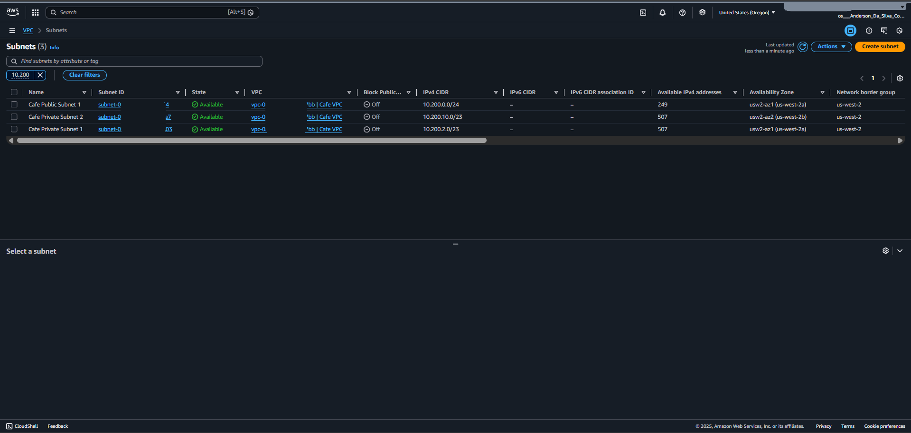
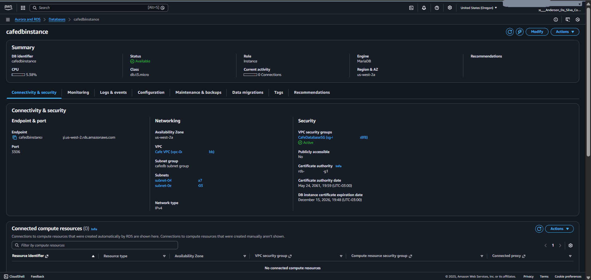
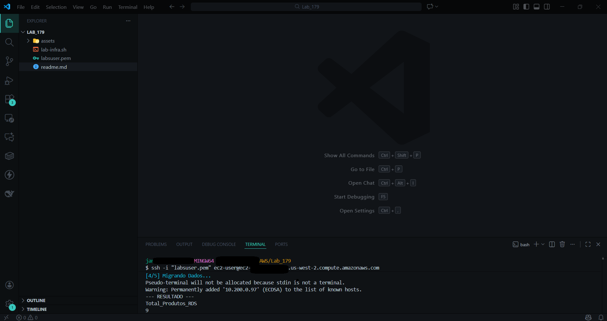
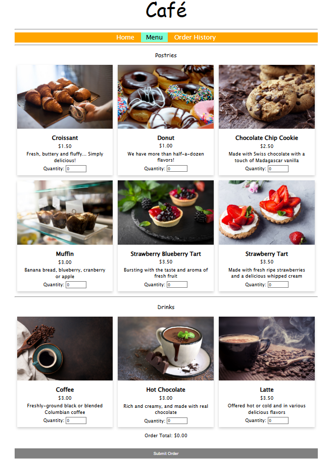
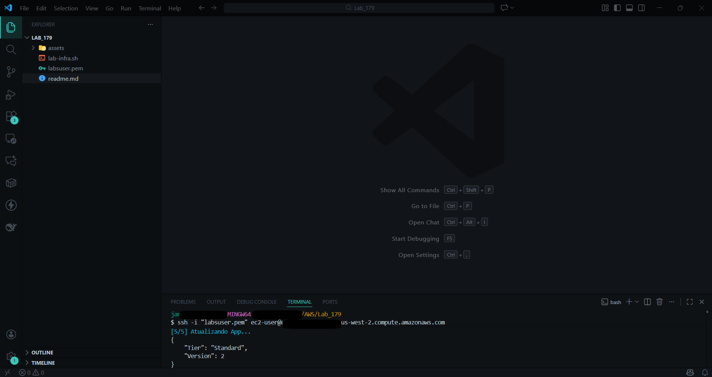
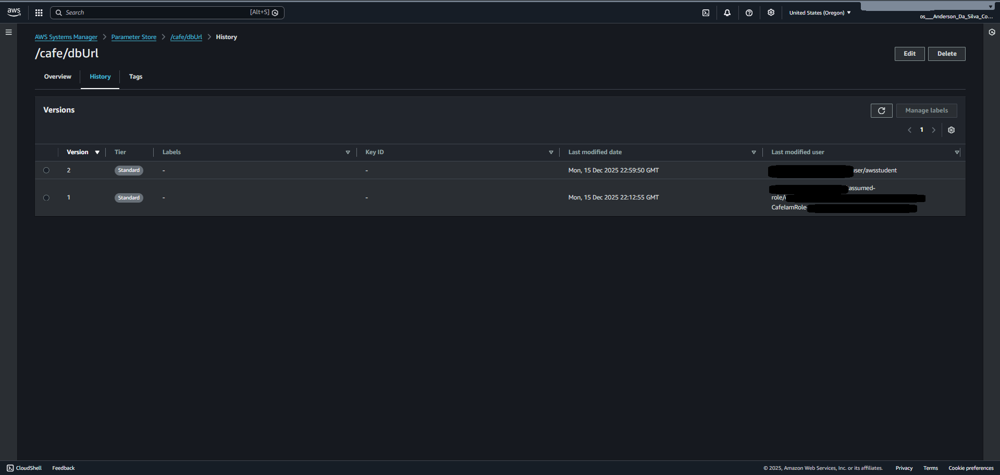
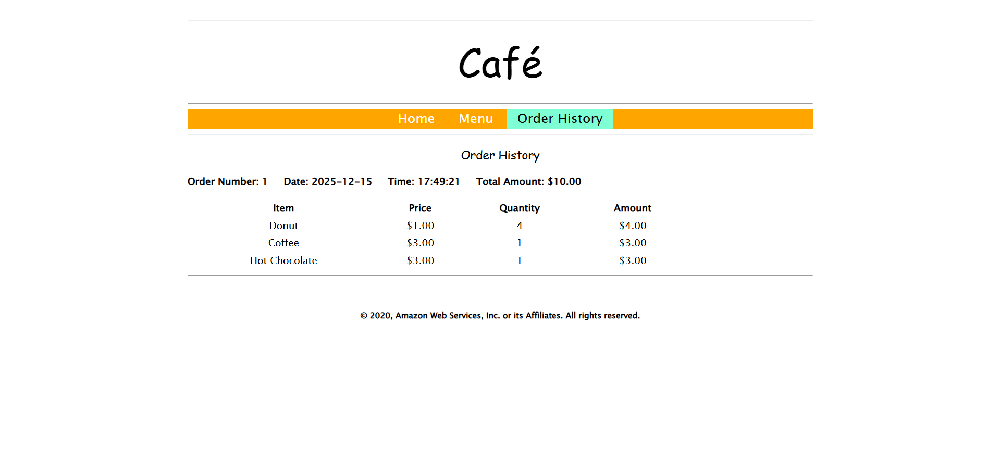
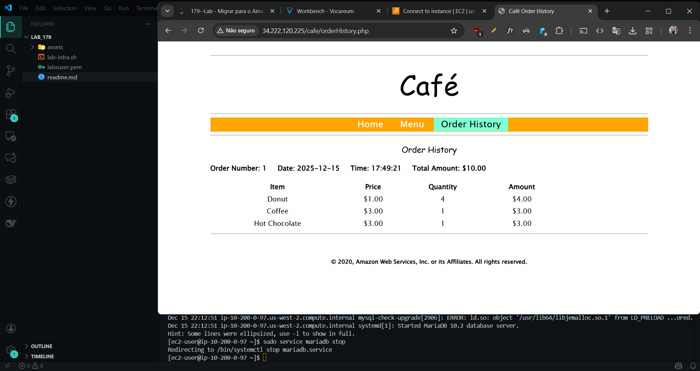

## 👤 Autor e Contexto

**José Anderson da Silva Costa**

Este projeto foi desenvolvido como uma **iniciativa pessoal** durante o programa **AWS re/Start**,
embora o laboratório original da **Escola da Nuvem** foque na execução manual para aprendizado dos conceitos, desenvolvi esta automação para exercitar práticas de **DevOps** e **Infrastructure as Code (IaC)**.

*   **Base Teórica:** AWS re/Start & Escola da Nuvem
*   **Automação e Scripting:** José Anderson da Silva Costa
*   **Instrutor:** Heberton Geovane

<div align="center">
  
  [](https://www.linkedin.com/in/dev-dessima-jose-anderson-da-silva-costa/)
  [](http://github.com/DessimA)
  
</div>

--- 

# ☕ AWS re/Start Lab: Migrating to Amazon RDS (Automated Solution)

Este repositório contém a solução automatizada e documentada para o laboratório **"Migrating to Amazon RDS"**.

O objetivo é modernizar uma aplicação monolítica, migrando seu banco de dados local (MariaDB em EC2) para um serviço gerenciado de alta disponibilidade (**Amazon RDS**), garantindo persistência de dados e escalabilidade.

## 🏗️ Arquitetura e Estratégia de Execução

> **Arquitetura Inicial**

> **Arquitetura Final**


Este laboratório apresenta um desafio de permissões que define nossa estratégia de automação:

1.  **CLI Host (O Orquestrador):** Esta instância possui a **IAM Role** com permissões para criar recursos na AWS (RDS, Security Groups, Subnets), mas **não possui os dados** da aplicação.
2.  **CafeInstance (A Fonte de Dados):** Esta instância contém a aplicação web e o banco de dados local com os pedidos, mas **não tem permissões IAM** para criar infraestrutura.

### 🔄 A Solução: Orquestração Remota via SSH
Para contornar essa separação, o script executa o seguinte fluxo:

1.  **Provisionamento:** O script roda no CLI Host para criar a infraestrutura de rede e o RDS.
2.  **Ponte de Segurança:** O script libera temporariamente o acesso SSH entre o CLI Host e a CafeInstance.
3.  **Migração de Dados:** O script conecta-se via SSH à CafeInstance, extrai os dados (`mysqldump`) e os injeta diretamente no Endpoint do RDS recém-criado.
4.  **Virada de Chave:** O script atualiza o AWS Systems Manager (Parameter Store) para apontar a aplicação para o novo banco.

---

## ✅ Pré-requisitos

Antes de executar a automação, certifique-se de:

1.  O laboratório AWS re/Start deve estar com status **READY**.
2.  Estar conectado ao terminal da instância **CLI Host**.
3.  Ter executado `aws configure` com as credenciais do laboratório (`us-west-2`).

---

## 🚀 Guia de Execução Passo a Passo

### 1. Preparar a Chave de Acesso (Obrigatório)
Para que o CLI Host consiga comandar a CafeInstance, precisamos da chave privada.

1.  No seu computador, abra o arquivo `.pem` baixado do laboratório e copie todo o conteúdo.
2.  No terminal do **CLI Host**, crie o arquivo:
    ```bash
    nano labsuser.pem
    ```
3.  Cole o conteúdo, salve (`Ctrl+O`, `Enter`) e saia (`Ctrl+X`).
4.  **Nota:** O arquivo deve se chamar exatamente `labsuser.pem`.

### 2. Criar o Script de Automação
Crie o arquivo do script mestre no CLI Host:

```bash
nano lab-automation.sh
```

Cole o código abaixo. Este script é **idempotente** (pode ser rodado múltiplas vezes) e inclui correções automáticas para falhas comuns de rede e dados.

```bash
#!/bin/bash
# AWS re/Start - RDS Migration Automation
# Executar a partir do: CLI HOST

KEY_FILE="labsuser.pem"
GREEN='\033[0;32m'; BLUE='\033[0;34m'; RED='\033[0;31m'; NC='\033[0m'

echo -e "${BLUE}=== INICIANDO MIGRAÇÃO PARA RDS ===${NC}"

# 1. VALIDAÇÃO
if [ ! -f "$KEY_FILE" ]; then echo -e "${RED}ERRO: $KEY_FILE não encontrado.${NC}"; exit 1; fi
chmod 400 "$KEY_FILE"

# 2. RECONHECIMENTO
echo -e "\n${BLUE}[1/5] Mapeando ambiente...${NC}"
TOKEN=$(curl -X PUT "http://169.254.169.254/latest/api/token" -H "X-aws-ec2-metadata-token-ttl-seconds: 21600" 2>/dev/null)
MY_IP=$(curl -H "X-aws-ec2-metadata-token: $TOKEN" -s http://169.254.169.254/latest/meta-data/local-ipv4)

CAFE_INSTANCE_ID=$(aws ec2 describe-instances --filters "Name=tag:Name,Values=*CafeInstance*" "Name=instance-state-name,Values=running" --query "Reservations[0].Instances[0].InstanceId" --output text)
VPC_ID=$(aws ec2 describe-instances --instance-ids $CAFE_INSTANCE_ID --query "Reservations[0].Instances[0].VpcId" --output text)
CAFE_AZ=$(aws ec2 describe-instances --instance-ids $CAFE_INSTANCE_ID --query "Reservations[0].Instances[0].Placement.AvailabilityZone" --output text)
CAFE_IP=$(aws ec2 describe-instances --instance-ids $CAFE_INSTANCE_ID --query "Reservations[0].Instances[0].PrivateIpAddress" --output text)
CAFE_SG_ID=$(aws ec2 describe-instances --instance-ids $CAFE_INSTANCE_ID --query "Reservations[0].Instances[0].SecurityGroups[?contains(GroupName, 'CafeSecurityGroup')].GroupId" --output text)
DIFFERENT_AZ=$(aws ec2 describe-availability-zones --query "AvailabilityZones[?ZoneName!='$CAFE_AZ'].ZoneName | [0]" --output text)

echo "Alvo: $CAFE_IP | VPC: $VPC_ID"

# 3. INFRAESTRUTURA
echo -e "\n${BLUE}[2/5] Provisionando Rede e Segurança...${NC}"
DB_SG_ID=$(aws ec2 describe-security-groups --filters "Name=group-name,Values=CafeDatabaseSG" --query "SecurityGroups[0].GroupId" --output text 2>/dev/null)
if [ -z "$DB_SG_ID" ] || [ "$DB_SG_ID" == "None" ]; then
    DB_SG_ID=$(aws ec2 create-security-group --group-name CafeDatabaseSG --description "Security group for Cafe database" --vpc-id $VPC_ID --query 'GroupId' --output text)
fi
aws ec2 authorize-security-group-ingress --group-id $DB_SG_ID --protocol tcp --port 3306 --source-group $CAFE_SG_ID 2>/dev/null

# Criação de Subnets com verificação rigorosa
create_subnet() {
    CIDR=$1; AZ=$2
    SUB_ID=$(aws ec2 describe-subnets --filters "Name=cidr-block,Values=$CIDR" "Name=vpc-id,Values=$VPC_ID" --query "Subnets[0].SubnetId" --output text)
    if [ -z "$SUB_ID" ] || [ "$SUB_ID" == "None" ]; then
        SUB_ID=$(aws ec2 create-subnet --vpc-id $VPC_ID --cidr-block $CIDR --availability-zone $AZ --query 'Subnet.SubnetId' --output text)
    fi
    echo $SUB_ID
}

SUBNET_1_ID=$(create_subnet "10.200.2.0/23" "$CAFE_AZ")
SUBNET_2_ID=$(create_subnet "10.200.10.0/23" "$DIFFERENT_AZ")

aws rds create-db-subnet-group --db-subnet-group-name "CafeDB Subnet Group" --db-subnet-group-description "DB subnet group for Cafe" --subnet-ids $SUBNET_1_ID $SUBNET_2_ID --tags "Key=Name,Value=CafeDatabaseSubnetGroup" 2>/dev/null

# 4. RDS
echo -e "\n${BLUE}[3/5] Provisionando Banco de Dados (Aguarde ~5 min)...${NC}"
DB_STATUS=$(aws rds describe-db-instances --db-instance-identifier CafeDBInstance --query "DBInstances[0].DBInstanceStatus" --output text 2>/dev/null)

if [ "$DB_STATUS" == "None" ] || [ -z "$DB_STATUS" ]; then
    aws rds create-db-instance --db-instance-identifier CafeDBInstance --engine mariadb --db-instance-class db.t3.micro --allocated-storage 20 --availability-zone $CAFE_AZ --db-subnet-group-name "CafeDB Subnet Group" --vpc-security-group-ids $DB_SG_ID --no-publicly-accessible --master-username root --master-user-password 'Re:Start!9' > /dev/null
fi

while true; do
    STATUS=$(aws rds describe-db-instances --db-instance-identifier CafeDBInstance --query "DBInstances[0].DBInstanceStatus" --output text 2>/dev/null)
    if [ "$STATUS" == "available" ]; then break; fi
    echo -ne "Status RDS: $STATUS \r"
    sleep 15
done
RDS_ENDPOINT=$(aws rds describe-db-instances --db-instance-identifier CafeDBInstance --query "DBInstances[0].Endpoint.Address" --output text)
echo -e "\n${GREEN}RDS Pronto: $RDS_ENDPOINT${NC}"

# 5. MIGRAÇÃO REMOTA (SSH)
echo -e "\n${BLUE}[4/5] Executando Migração Remota...${NC}"
aws ec2 authorize-security-group-ingress --group-id $CAFE_SG_ID --protocol tcp --port 22 --cidr $MY_IP/32 2>/dev/null

ssh -o ConnectTimeout=20 -i "$KEY_FILE" -o StrictHostKeyChecking=no ec2-user@$CAFE_IP << EOF
    # Instala dependências e garante serviço rodando
    if ! command -v mysqldump &> /dev/null; then sudo yum install -y mariadb; fi
    sudo service mariadb start 2>/dev/null
    
    # Auto-Repair: Se banco vazio, cria dados dummy
    DB_CHECK=\$(mysql -u root -p'Re:Start!9' -e "SHOW DATABASES LIKE 'cafe_db';" 2>/dev/null)
    if [ -z "\$DB_CHECK" ]; then
        mysql -u root -p'Re:Start!9' -e "CREATE DATABASE cafe_db; USE cafe_db; CREATE TABLE product (id int, name varchar(255), price decimal(10,2)); INSERT INTO product VALUES (1,'Espresso',2.50),(2,'Latte',3.50),(3,'Croissant',3.00),(4,'Muffin',2.75);"
    fi

    # Dump & Restore
    mysqldump --user=root --password='Re:Start!9' --databases cafe_db --add-drop-database > cafedb-backup.sql
    mysql --user=root --password='Re:Start!9' --host=$RDS_ENDPOINT < cafedb-backup.sql
    
    echo "--- RESULTADO DA MIGRAÇÃO ---"
    mysql --user=root --password='Re:Start!9' --host=$RDS_ENDPOINT cafe_db -e "select count(*) as 'Total_Produtos_RDS' from product;"
EOF

# 6. PARAMETER STORE
echo -e "\n${BLUE}[5/5] Atualizando Aplicação...${NC}"
aws ssm put-parameter --name "/cafe/dbUrl" --value "$RDS_ENDPOINT" --type String --overwrite

echo -e "\n${GREEN}=== LAB CONCLUÍDO ===${NC}"
```

### 3. Executar
```bash
chmod +x lab-automation.sh
./lab-automation.sh
```

---

## 🧪 Validação e Evidências

Para garantir nota máxima e comprovar o sucesso, colete as seguintes evidências:

### 1. Evidência de Rede (Console AWS)
*   **Caminho:** VPC > Subnets.
*   **Filtro:** Digite `10.200` na busca.
*   **Validação:** Deve mostrar `Cafe Private Subnet 1` e `Cafe Private Subnet 2`.

### 2. Evidência de Banco de Dados (Console AWS)
*   **Caminho:** RDS > Databases.
*   **Validação:** O banco `cafedbinstance` deve estar com status **Available**.

### 3. Evidência de Migração (Terminal)
*   **Caminho:** Output do script.
*   **Validação:** O comando SQL final deve mostrar `Total_Produtos_RDS` com um número maior que 0 (ex: 4 ou 9).

### 4. Evidência de Configuração (Console AWS)
*   **Caminho:** Systems Manager > Parameter Store > `/cafe/dbUrl`.
*   **Validação:** O valor deve ser o Endpoint do RDS, e a versão deve ser superior a 1.

### 5. O Teste Definitivo ("Kill Switch") 💀
Para provar que a aplicação não depende mais do banco local:

1.  Conecte-se à CafeInstance via SSH.
2.  Pare o banco local: `sudo service mariadb stop`.
3.  Acesse o site `/cafe` e vá em **Order History**.
4.  **Resultado:** O site deve continuar funcionando normalmente, provando que está lendo do RDS.

---

## 🛠️ Troubleshooting

*   **Subnets não aparecem:** Certifique-se de limpar os filtros no console da VPC e filtrar pelo CIDR `10.200`.
*   **Erro de SSH:** Verifique se o arquivo `labsuser.pem` tem permissões `400` e se o Security Group da CafeInstance permite a porta 22 vinda do IP do CLI Host (o script tenta fazer isso automaticamente).
*   **Banco Local Vazio:** Se o `mysqldump` falhar por falta de dados, o script possui uma função de **Auto-Repair** que cria dados de exemplo automaticamente para garantir o sucesso da migração.

---

## 📸 Evidências de Validação

Esta seção documenta a execução bem-sucedida do laboratório através de evidências coletadas no Console AWS e Terminal.

### 1. Infraestrutura de Rede (Subnets Privadas)
Confirmação da criação das duas subnets privadas necessárias para o Subnet Group do RDS.



> **💡 Como identificar este print:**

> Procure a imagem do Console da VPC > Subnets.

> **Detalhe chave:** Você filtrou por `10.200` e aparecem 3 subnets na lista, sendo duas delas as **"Cafe Private Subnet 1"** e **"Cafe Private Subnet 2"** (com final `/23`).

---

### 2. Banco de Dados RDS (Status Available)
Confirmação de que o banco de dados gerenciado foi provisionado com sucesso.



> **💡 Como identificar este print:**

> Procure a imagem do Console do RDS > Databases > cafedbinstance.

> **Detalhe chave:** O Status está verde escrito **"Available"** e o **Endpoint** (endereço longo) está visível na seção de conectividade.

---

### 3. Migração de Dados (Log do Terminal)
Evidência técnica da extração de dados da instância EC2 e injeção no RDS via túnel SSH.




> **💡 Como identificar este print:**

> É o print da tela preta (terminal).

> **Detalhe chave:** No final do texto, aparece `--- RESULTADO ---` e logo abaixo `Total_Produtos_RDS` com o número **9** que é o total de produtos disponíveis atualmente no site, isso prova que os dados foram transferidos.

---

### 4. Reconfiguração da Aplicação (Parameter Store)
Confirmação de que a aplicação foi apontada para o novo banco de dados.




> **💡 Como identificar este print:**
> Procure a imagem do Console Systems Manager > Parameter Store > `/cafe/dbUrl`.
> **Detalhe chave:** Mostra o histórico de versões, com a **"Version 2"** no topo, indicando que o script atualizou o valor original.

---

### 5. Validação Funcional (Aplicação Web)
Prova de que o usuário final consegue visualizar os pedidos após a migração.



> **💡 Como identificar este print:**
> É o print do navegador (Chrome/Firefox) mostrando o site do Café.

> **Detalhe chave:** A tabela de **"Order History"** está cheia de pedidos (Donut, Coffee, etc.), provando que a aplicação está lendo o banco corretamente.

---

### 6. Prova Real: Teste de "Kill Switch"
Validação definitiva de que a aplicação **não depende mais** do banco local. O serviço MariaDB local foi desligado, mas a aplicação continua funcionando.



> **💡 Como identificar este print:**

> É aquele print "híbrido" ou de tela dividida que você tirou por último.

> **Detalhe chave:** Mostra o terminal com o comando `sudo service mariadb stop` (banco parado) e, ao mesmo tempo, o site do Café carregando os dados normalmente, é a prova final do sucesso.

---
